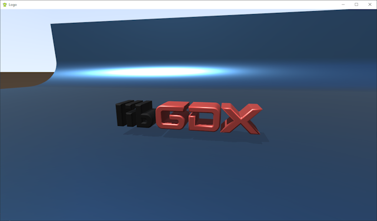

# Logo

A [libGDX](https://libgdx.com/) project generated with [gdx-liftoff](https://github.com/tommyettinger/gdx-liftoff).

Displaying a 3d LibGDX logo using gdx-gtlf.

Note:
- the camera motion is sickening, I know...
- the backdrop object should not move with the logo. It is just there for some contrast.
- this could be the basis to do some cute animation with the logo, maybe as game intro.

